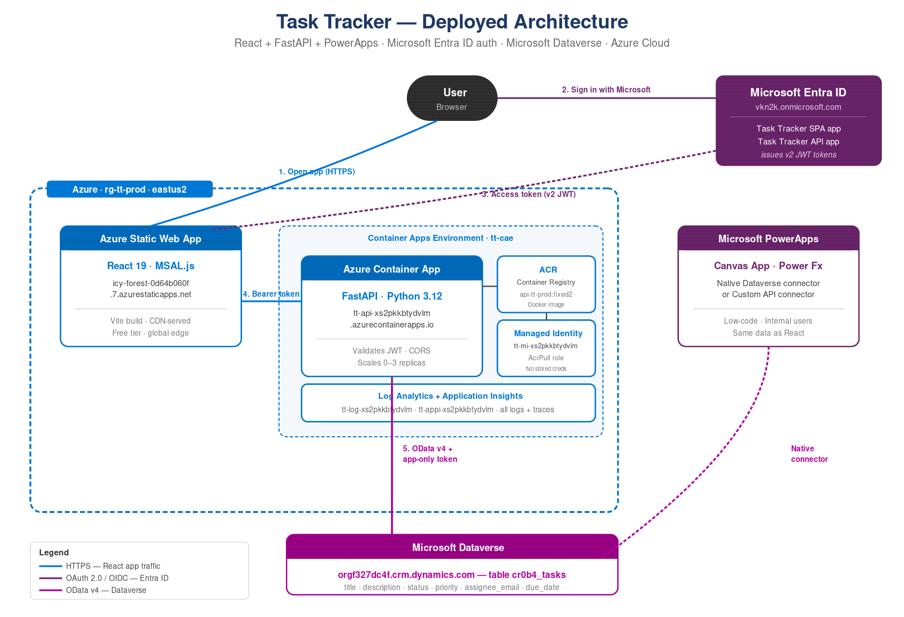

# Task Tracker

A small but real enterprise-style task management app that demonstrates how **three very different technologies** can work together using **one Microsoft identity**:

- **React** — a modern frontend that runs in the browser
- **Python (FastAPI)** — a backend that handles requests and talks to a database
- **Microsoft PowerApps** — a low-code app that reads the same data without writing any backend code

All three are wired up through **Microsoft Entra ID** for sign-in and **Microsoft Dataverse** as the shared database. The whole thing is deployable to **Microsoft Azure** with one command.



---

## Table of contents

1. [What is this and why does it exist?](#what-is-this-and-why-does-it-exist)
2. [Quick demo](#quick-demo)
3. [Glossary — every weird word explained](#glossary)
4. [Prerequisites](#prerequisites)
5. [Run it locally on your computer](#run-it-locally)
6. [Deploy it to Azure (the cloud)](#deploy-to-azure)
7. [How the code is organized](#how-the-code-is-organized)
8. [Common problems and how to fix them](#troubleshooting)
9. [What to learn next](#what-to-learn-next)

---

## What is this and why does it exist?

If you've worked in any company that uses Microsoft 365, you've seen this tension play out:

- The **developers** want React because it's modern and fast.
- The **data folks** want Python because every integration in the world has a Python library.
- The **business users** want PowerApps because they can build something in an afternoon, no code needed.

The good news: **you don't have to choose**. With Microsoft Entra ID as the identity layer and Microsoft Dataverse as the shared data store, all three play together — same user, same data, three different surfaces.

This project is a working example of exactly that. It's a tiny task tracker (add a task, mark it done) but the plumbing under the hood is real production-grade enterprise architecture.

## Quick demo

After you run it (instructions below), you can:

1. Open the React app at `http://localhost:5173`
2. Click **"Sign in with Microsoft"** — you authenticate with your work or school account
3. Click **"Load tasks"** — empty at first
4. Type a task title, pick a priority, click **Add** — it saves to Dataverse
5. Optionally: open the same Dataverse table in PowerApps and see the same task

That last step is the magic — your React app and your PowerApps app are looking at the same row in the same table.

---

## Glossary

If any of these words made your eyes glaze over above, here's plain English for each one.

| Word | What it actually means |
| --- | --- |
| **Microsoft Entra ID** | Microsoft's identity service. Used to be called "Azure Active Directory" or just "Azure AD". When you sign in to anything with `@yourcompany.com`, this is what's checking your password. |
| **Tenant** | Your company's slice of Microsoft Entra ID. Identified by a name like `contoso.onmicrosoft.com` and a GUID. |
| **App registration** | The way you tell Entra ID "this app exists, here's its name, here's where to send users after sign-in." Every app that uses Microsoft sign-in needs one of these. |
| **JWT** (JSON Web Token) | A signed digital ID card. When you sign in, Entra ID gives the React app a JWT proving who you are. React shows it to the Python backend, which checks the signature. |
| **OAuth 2.0** | The standard for "let me sign in with another service." MSAL.js, the React library used here, implements OAuth 2.0 behind the scenes. |
| **MSAL** | Microsoft's library for getting OAuth tokens. Comes in several flavors: `msal-browser` for JavaScript, `msal-python` for Python. |
| **FastAPI** | A Python framework for building web APIs. Like Flask or Express.js but faster and with type hints. |
| **Uvicorn** | The "engine" that runs FastAPI. When you see `uvicorn app.main:app` you're saying "run the app I built with FastAPI." |
| **Dataverse** | Microsoft's enterprise database. Comes with PowerApps. Stores rows in tables, but you talk to it through an HTTP API instead of SQL. |
| **OData** | A standard way of asking an HTTP API for data. Dataverse speaks OData v4. |
| **Publisher prefix** | Every custom Dataverse table column gets a 2–8 letter prefix unique to your tenant, e.g. `cr0b4_title`. The code in this repo uses `cr0b4_` — you'll change it to match your tenant's prefix. |
| **PowerApps** | Microsoft's no-code/low-code app builder. You drag controls onto a canvas, write Excel-like formulas, and connect to data. |
| **Azure** | Microsoft's cloud. Where you'd deploy the app once you want it to be reachable from anywhere. |
| **Container** | A package containing your app and everything it needs to run. Think of it as a portable installer. We use Docker. |
| **Bicep** | Microsoft's "describe my cloud infrastructure in code" language. The file `infra/main.bicep` is the recipe for everything we deploy in Azure. |
| **azd** | Azure Developer CLI. A command-line tool that reads the Bicep recipe and provisions everything for you. |
| **CORS** | Cross-Origin Resource Sharing. Browser security rule: a webpage at `localhost:5173` can't normally call an API at a different domain unless that API explicitly opts in. |
| **Endpoint** | A specific URL on an API, e.g. `GET /api/tasks` or `POST /api/tasks`. |
| **`.env` file** | A plain text file holding configuration values like API keys and database URLs. Never check these into git. |

---

## Prerequisites

Before doing anything, you need these things installed on your computer.

| What | Why you need it | Install link |
| --- | --- | --- |
| **Python 3.11 or newer** | Runs the backend | https://www.python.org/downloads/ |
| **Node.js 20 or newer** | Runs the frontend build tool | https://nodejs.org/ |
| **Git** | Downloads this code | https://git-scm.com/downloads |
| **A code editor** | VS Code is free and recommended | https://code.visualstudio.com/ |
| **A web browser** | Microsoft Edge or Google Chrome | (you have one) |

**You also need:**

- A **Microsoft 365** account at a company or school (a free dev tenant works — sign up at https://developer.microsoft.com/microsoft-365/dev-program).
- **Admin rights** in that tenant — you need to be able to create app registrations and grant admin consent.
- A **Power Platform environment** with **Dataverse** enabled (free Developer Plan works). Create at https://admin.powerplatform.microsoft.com.

If you don't have admin rights or Dataverse, you can still run the app **locally with the SQLite backend** which skips Dataverse entirely (see Step 3 below).

---

## Run it locally

Total time once prerequisites are installed: **~30 minutes** the first time.

### Step 1 — Get the code

```bash
git clone https://github.com/usreekanthreddy/task-tracker.git
cd task-tracker
```

### Step 2 — Register two apps in Microsoft Entra ID

We need two app registrations: one for the API, one for the frontend.

**2a. The API app**

1. Go to **https://entra.microsoft.com**, sign in with your work/school account.
2. **Identity** → **Applications** → **App registrations** → **+ New registration**.
3. Name: `Task Tracker API`. Single tenant. No redirect URI. Click **Register**.
4. From the overview, copy:
   - **Application (client) ID** → save as `API_CLIENT_ID`
   - **Directory (tenant) ID** → save as `TENANT_ID`
5. **Expose an API** → **Add** next to "Application ID URI" → **Save**.
6. **+ Add a scope**: name `access_as_user`, who can consent **Admins and users**, display name "Access Task Tracker as the signed-in user", description "Allows the app to call the Task Tracker API on behalf of the signed-in user." State **Enabled** → **Add scope**.
7. **Certificates & secrets** → **+ New client secret** → 24 months → **Add**. Copy the **Value** immediately → save as `API_CLIENT_SECRET`.
8. **API permissions** → **+ Add a permission** → **Dynamics CRM** → **Delegated permissions** → check `user_impersonation` → **Add permission**.
9. Click **Grant admin consent for [your tenant]** at the top → Yes.
10. **Manifest** → find `"requestedAccessTokenVersion": null` → change `null` to `2` → **Save**. (This tells Entra to issue v2.0 tokens, which fastapi-azure-auth expects.)

**2b. The SPA app**

1. **App registrations** → **+ New registration**.
2. Name: `Task Tracker SPA`. Single tenant. Redirect URI: **Single-page application (SPA)** → `http://localhost:5173`. Click **Register**.
3. Copy the **Application (client) ID** → save as `SPA_CLIENT_ID`.
4. **API permissions** → **+ Add a permission** → **My APIs** → click **Task Tracker API** → check `access_as_user` → **Add permission**.
5. Click **Grant admin consent** → Yes.

### Step 3 — (Optional) Create the Dataverse table

If you want Dataverse: follow [docs/DOCS.md](docs/DOCS.md) section 4.4 — create a `Task` table with columns Title, Description, Status (choice: Not Started/In Progress/Done), Priority (choice: Low/Medium/High), AssigneeEmail, DueDate.

If you want to skip Dataverse and use a local SQLite database, edit `backend/app/main.py` and change `from . import dataverse as store` to `from . import sqlite_store as store`. The app will store tasks in `backend/tasks.db`.

### Step 4 — Configure the backend

```bash
cd backend
cp .env.example .env
```

Edit `.env` and fill in the values from Step 2.

### Step 5 — Install Python deps and run

**Windows:**
```powershell
python -m venv .venv
.venv\Scripts\activate
pip install -r requirements.txt
uvicorn app.main:app --reload --port 8000
```

**Mac/Linux:**
```bash
python3 -m venv .venv
source .venv/bin/activate
pip install -r requirements.txt
uvicorn app.main:app --reload --port 8000
```

You should see `Uvicorn running on http://0.0.0.0:8000`. Leave this terminal running and open a new one.

Verify: open http://localhost:8000/docs in your browser. You should see the FastAPI auto-generated API docs.

### Step 6 — Configure the frontend

```bash
cd frontend
cp .env.example .env
```

Edit `.env` with the same IDs from Step 2.

### Step 7 — Install Node deps and run

```bash
npm install
npm run dev
```

You should see `VITE ready ... Local: http://localhost:5173/`.

### Step 8 — Open the app

Visit **http://localhost:5173**. Click **Sign in with Microsoft**, then **Load tasks**, then add a task. If something doesn't work, jump to [Troubleshooting](#troubleshooting).

---

## Deploy to Azure

This puts your app on the public internet. Free trial Azure subscription works ($200 credit). Idle cost: **about $2-5/month**.

### Quick deploy with `azd`

```bash
# Install Azure CLI: https://aka.ms/InstallAzureCLI
# Install azd: https://aka.ms/azd-install
# Install Docker Desktop: https://www.docker.com/products/docker-desktop

az login
azd auth login

cd task-tracker
azd init -e prod
azd env set API_CLIENT_SECRET '<your secret from step 2a.7>'
azd env set TENANT_ID '<your tenant id>'
azd env set API_CLIENT_ID '<your API client id>'
azd env set SPA_CLIENT_ID '<your SPA client id>'
azd env set DATAVERSE_URL 'https://orgXXXXXXXX.crm.dynamics.com'
azd up
```

After ~5-8 minutes, `azd` prints two URLs.

**One post-deploy step**: add the Static Web App URL as a redirect URI on your **Task Tracker SPA** registration in Entra ID.

Full walkthrough: [DEPLOY.md](DEPLOY.md).

---

## How the code is organized

```
task-tracker/
├── backend/                       The Python API
│   ├── app/
│   │   ├── main.py                FastAPI app, routes, middleware
│   │   ├── auth.py                Validates Entra ID JWTs
│   │   ├── settings.py            Loads env vars into typed Settings
│   │   ├── models.py              Pydantic models for tasks
│   │   ├── dataverse.py           Talks to Dataverse via OData
│   │   └── sqlite_store.py        Local SQLite fallback
│   ├── Dockerfile                 Production container recipe
│   ├── requirements.txt           Python deps
│   └── .env.example               Config template
│
├── frontend/                      The React app
│   ├── src/
│   │   ├── main.tsx               Entry point with MSAL
│   │   ├── App.tsx                The whole UI
│   │   ├── authConfig.ts          Microsoft sign-in config
│   │   ├── api.ts                 Backend API client
│   │   └── styles.css             Plain CSS
│   ├── package.json               Node deps
│   ├── staticwebapp.config.json   Azure SWA routing
│   └── .env.example               Config template
│
├── infra/                         Azure Bicep (infra-as-code)
│   ├── main.bicep                 All Azure resources
│   └── main.parameters.json       Parameters azd fills in
│
├── powerapps/                     PowerApps companion
│   ├── BUILD_GUIDE.md             Canvas app instructions
│   └── TaskTrackerAPI.connector.json  Custom connector spec
│
├── docs/                          Learning material
│   ├── DOCS.md                    Detailed walkthrough
│   ├── architecture.svg / .png    Architecture diagram
│   ├── Task_Tracker_Architecture.pptx  5-slide deck
│   ├── Task_Tracker_Documentation.docx Word version
│   └── blog-post.html             Ready-to-paste blog
│
├── azure.yaml                     azd manifest
├── DEPLOY.md                      Full Azure deploy guide
├── README.md                      You are here
└── .gitignore                     Keeps .env out of git
```

---

## Troubleshooting

| Error you see | What's wrong | Fix |
| --- | --- | --- |
| `AADSTS65001 consent required` when signing in | SPA hasn't been granted permission to call the API | SPA app → API permissions → "Grant admin consent" |
| `AADSTS50011 reply URL does not match` | Redirect URI doesn't match where the app is running | Add `http://localhost:5173` under SPA platform in SPA app registration |
| `401 Unauthorized` from the backend | Token isn't accepted by FastAPI | Paste your token at https://jwt.ms — verify `aud` is `api://<API_CLIENT_ID>` and `iss` ends with `/v2.0`. If `iss` says `sts.windows.net`, do step 2a.10 (manifest v2). |
| `403 Forbidden` from Dataverse | API app doesn't have a Dataverse role | https://admin.powerplatform.microsoft.com → your environment → Settings → Users + permissions → Application users → add the API app with System Customizer role |
| `CORS error` in browser console | Backend doesn't allow the frontend's origin | Make sure `ALLOWED_ORIGINS` in `backend/.env` matches where the frontend runs |
| `uvicorn: command not found` | Virtualenv not activated | Re-run `.venv\Scripts\activate` (Windows) or `source .venv/bin/activate` (Mac/Linux) |
| Tasks save but don't appear | uvicorn didn't pick up code changes | Add `--reload` flag, or restart uvicorn |

**Best debugging tool**: paste your access token at **https://jwt.ms** to see exactly what's inside. 90% of auth bugs become obvious immediately.

---

## What to learn next

Once you have the app working:

1. **Add a Power Automate flow** that emails the assignee when a task is created.
2. **Add roles** to the SPA users (Admin, Reader) and check the `roles` claim in FastAPI.
3. **Build the PowerApps canvas app** following [powerapps/BUILD_GUIDE.md](powerapps/BUILD_GUIDE.md).
4. **Add Application Insights custom events** for usage analytics.
5. **Add a GitHub Actions workflow** that runs `azd deploy` on every push to `main`.
6. **Swap Dataverse for Postgres** on Azure Database for PostgreSQL Flexible Server.

## Project status

- Tested with React 19, Vite 7, FastAPI 0.115, Python 3.12
- Last verified against Microsoft documentation: **May 2026**

## License

MIT. Use it, fork it, ship it. No warranty.

## Credits

Built end-to-end in a single session with **Claude** (Anthropic). Story behind it: [docs/blog-post.html](docs/blog-post.html).
